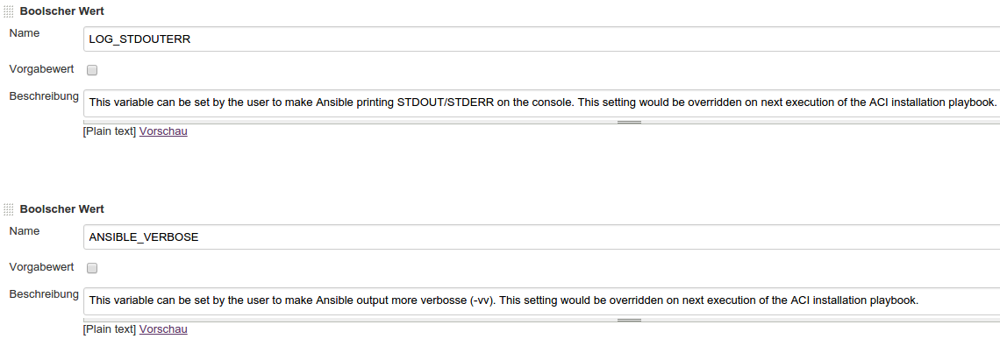
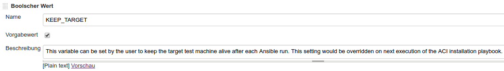

#  AnsibleCI

The following sections describe how to use ACI for testing your Ansible artifacts and create a Continuous Deployment Pipeline.

## First Steps

After you have configured and run the ACI-Installation-Playbook you can access the AnsibleCI (Jenkins), which will show you at least the `03_RUN_TESTS` job and one `01_DEVELOP_<repolabel>` job per repository configured. Assumed you have configured one repository with the label _myrepo_, you will see those two Jobs in ACI:

| name              | functionality                                                                                                                                           |
| ----------------- | ------------------------------------------------------------------------------------------------------------------------------------------------------- |
| GIT\_PULL\_myrepo | This role will checkout the git repository in intervals and create new test jobs for every Ansible role and playbook prepared to be tested (see below). |
| RUN\_CHECK        | This role is called by a test job created by the GIT\_PULL job and will run the tests itself.                                                           |

## Enable Testing

ACI is not testing your roles and playbooks by default, as long they are not prepared to be testetd. The followng two sections describe what has to be done to let ACI test your roles and playbooks.

### Testing Roles

To enable role testing, the role must contain a folder called `examples` in the root of the role directory. This folder can contain an arbitrary number of subfolders containing playbooks. On the one hand those playbook folders are a documentation of the role itself and on the other hand the playbooks are instructions for ACI how to test the execution of the role. The playbook files itself must be named `site.yml`. The rest of the subfolders can contain any playbook content nescessary to execute the playbook.

Here is an example of how a simple role with ACI testing enabled could look like:

    role
    ├── defaults
    │   └── main.yml
    ├── examples
    │   └── default
    │       └── site.yml
    └── tasks
        └── main.yml

Here is an example of how the content of `examples/default/site.myl` could look like:

    - name: example usage of my.apache
      hosts: target

      roles:
       - role: my.apache
          php_enabled: yes

As you can see this is a usual playbook content. You can use an arbitrary name for the `hosts` variable, as ACI will replace it with its own proper hosts definition. Any further instructions will be interpret by ACI as-is. For example you can use any variables for you playbook you want.

### Testing Playbooks

Enabling Playbooks to be tested by ACI is much easier then enabling roles because the playbook to test is already there. The only condition is that your playbook file is called `site.yml`. The target host will be automatically and temporarily replaced by ACI during the test run accordingly to the ACI Agent machine.

### Exclude / Include Playbooks from Testing

As well as for roles as for playbooks ACI is looking for the file `site.yml` to determine the playbook being tested. You can override this behavior with following intentions:

- You want to test multiple playbook files per folder not called `site.yml`
- You explicitly want to exclude a playbook

In this case you can mention you own playbook names, one per row in the `aci/playbooks` file in your playbooks folder. If you want to exclude a playbook from being tested, simply provide an empty empty `aci/playbooks` file.

## Configuring the testplan

The _testplan_ are the steps run during the test. The default testplan looks as follows:

1.  Lint all Ansible code to test for syntax errors
2.  Run the Playbook on a fresh VM to test it runs without failures
3.  Repeat the Playbook run on the same VM to test idempotency

For Roles with multiple test playbooks configured, just the first step is executed once for all files. All other steps will be repeated for every playbook.

If you have configured your roles and playbooks to be tested as described in the chapter before, the testplan from above is what you get as first result.

The default testplan can be extended by configuring optional steps. On the one hand this could be executing hook shell scripts before/after the playbook executions on the other hand this could be the execution of [Serverspec](http://serverspec.org/) as final step to test if the target machine has reached the expected state described in the playbook. A fully configured testplan would look like this:

1.  Lint all Ansible code to test for syntax errors
2.  Run the `before-playbooks.sh` hook script
3.  Run the Playbook on a fresh VM to test it runs without failures
4.  Run the `between-playbooks.sh` hook script
5.  Repeat the Playbook run on the same VM to test idempotency
6.  Run the `after-playbooks.sh` hook script
7.  Run Serverspec to test the results of the Playbook execution

### Hooks

Hooks are just bash scripts to be executed before/after the playbook execution. Those scripts must be stored under the relative path `aci/hooks` within your playbook directory. This applys to roles test playbooks as for usual playbooks. Those scripts must be named according to when they are executed (see testplan above):

    playbook
    ├── aci
    |   └── hooks
    |       ├── after-playbooks.sh
    ...     ├── before-playbooks.sh
            └── between-playbooks.sh

When executing tasks requiring root permissions within your hook scripts you can use sudo, as the vagrant user inside the VM is not prompted for passwords.

### Serverspec testing

To enable Serverspec testing your Playbook, the Playbook folder must contain contain a `aci/spec` folder containing at leat one Serverspec test file ending with `_spec.rb`. For example:

    playbook
    ├── aci
    |   └── spec
    |       └── default_spec.rb
    ...

The `*_spec.rb` files contain the Serverspec instructions, e.g. as follows:

    describe package('apache2') do
      it { should be_installed }
    end

    describe service('apache2') do
      it { should be_enabled }
      it { should be_running }
    end

    describe port(80) do
      it { should be_listening.with('tcp6') }
    end

Further information of how to write Serverspec tests see on the [official website](http://serverspec.org/).

## Configuring the Lint execution

You can exclude files from beeing linted by adding their names each per line to following file: `<ansible-artifact-dir>/examples/aci/lint-excludes`

## Configuring the Ansible execution

Sometimes you need to provide more information to Ansible when testing your roles/playbooks in ACI. The next sections will show you how.

### Test specific variables file

You can provide variables specific for the test run to the playbook, defining them wihtin the playbooks `aci/vars.yml` file. If this file exist it will automatically be included to every plays `vars_files` statement.

### Hostname of the test machine

The hostname of the target test VM is **acia.vm**. You can't change the host name but it is good to know the hostname, as you playbooks may require it for proper connections. However you don't need to define that hostname in you (test) playbooks, as ACI will automatically replace the target host temporarily before every test execution.

### Vault Files

You can set the vault password for each playbook during the configuration and installation of ACI itself. Thus you have to re-run the ACI installation playbook for changes taking effect.

The passwords for every playbook in every repository are set with the `PASSWORDS` variable as follows:

    PASSWORDS:
      - repository: myrepo
        playbooks:
          - name: my.firstrole
            vault: abcdefgh
            become: ijklmno
          - name: my.secondrole
            vault: 12345678
          - name: my.thirdrole
            become: uvxxyz

It is a good idea to store that variable of ACI itself.

You can also ignore the vault files provided by the playbooks to be tested. You then can define the variables from the ignored vault file inside the `aci/vars.yml` file shown before. The values should then be unconfidential and just for the test executions.

By default ACI is ignoring all (vault) files with the suffix `*.vault`. If you don't want those files to be excluded or set your own pattern for excluding files, you can insert one or more alternavite search patterns to the file `aci/varsfilesexcludes`. Each line of this file will be searched in the path of _every_ file in the playbook. If one search term is contained by a variables path, the file will be ignored. The original `.vault` search item will be replaced by the `aci/vaults` file.

### More verbose output

There are two options to gather more output of Ansible on the output of an ACI test. Both options could be set in the configuration of the `03_RUN_TESTS` role. There are the two variables `LOG_STDOUTERR` and `ANSIBLE_VERBOSE` you can activate.

The first option `LOG_STDOUTERR` would print all STDOUT/STDERR of tasks executed on the test VM in human readable format into the run log. This has nothing to do with the usual verbose output of Ansible.

Therefor is the second option `ANSIBLE_VERBOSE`. It will call Ansible with the option `-vv`.

Both settings would be overridden on the next run of the ACI install playbook itself.

### Keep target test machine alive

Escpecially when you run ACI locally and do recursive testing on a role or playbook, you maybe don't want the target test machine beeing destroyed after every testplan. For instance your playbook run into an error and repeating the playbook run until the error takes much time. To keep the target test machine after a testplan execution alive, you can check the option `KEEP_TARGET` inside the configuration of the `03_RUN_TESTS`.

You may have wondered what the `REMOVE_TARGET` job on the ACI tab was good for. At least until now it should be obvious that you can destroy the target machine manually when you have the `KEEP_TARGET` option active.

Pay attention that you may want to uncheck the `KEEP_TARGET` option after you have fixed your role or playbook, as re-using the same target machine throughout testplans and above all throughout test runs could lead to falsified test results.

### Custom Ansible Version / Version

You can define the Ansible version to use for testing and deployment. For setting the Ansible version to use for the whole repository, simply put a tag or commit id from the official [Ansible Github Repository](https://github.com/ansible/ansible) to the file `aci/ansible_version` within your repository.

You can also define an Ansible version specific for a role or playbook, which would override the repository setting. Then you have to put the commit id/tag into the `aci/ansible_version` within your (role test) playbook.

Analogous to the Ansible version you can define the branch in the `aci/ansible_branch` file. If both, the branch and the version, are supplied, the branch becomes applied first.

### Custom Ansible Repository

You can also define your custom Ansible repository to use for testing and deployment. This setting can just be done per ACI installation. To activate you have to provide the URL of the repository to the first line of the file `custom_ansible_repository` within your configuration directory mounted to the `/ansible_config` directory inside the ACI Docker container.

## Create a custom Testplan

In the Chapter [Configuring the testplan](#Configuring-the-testplan) we have learned that ACI is executing a testplan. We are able to configure the testplan by inserting predefined hooks and adding Serverspec tests. However we are also able to fully define our own testplan. All steps but the Linting can be defined inside the `aci/testplan` file in the playbook to test. The testplan is specific for each playbook, the linting is for the whole artifact. Thus linting is not part of the testplan and executed independently as first step.

If we would re-define the default testplan from the [Configuring the testplan](#Configuring-the-testplan) chapter within the `aci/testplan`, it would have following appearance:

    HOOK        before-playbooks
    ANSIBLE     'First Run'
    HOOK        between-playbooks
    ANSIBLE     'Repeated Run' 'IDEMPOTENCY' '--diff'
    HOOK        after-playbooks
    SERVERSPEC

Every line within the `aci/testplan` file is a test step. Every test step can have parameters, which when having whitespaces must be enclosed in single quotes. Following step types are available:

| Step       | param1                                                      | param2                   | param3          | description                                                                                                                                                                                                                                                                                                                                                                                                                                                                                                       |
| ---------- | ----------------------------------------------------------- | ------------------------ | --------------- | ----------------------------------------------------------------------------------------------------------------------------------------------------------------------------------------------------------------------------------------------------------------------------------------------------------------------------------------------------------------------------------------------------------------------------------------------------------------------------------------------------------------- |
| HOOK       | filename of hook inside `aci/hooks` directory without '.sh' |                          |                 | Executes a hook script, which must be present inside the `aci` directory. The '.sh' postfix must not be given.                                                                                                                                                                                                                                                                                                                                                                                                    |
| ANSIBLE    | descriptive name of the step                                | grep pattern for success | Ansible options | Executes an ansible-playbook execution. The first parameter, the descriptive name of the run, is mandatory, the letter ones not. The second parameter can be a pattern which, if found with grep in the output of Ansible, means the step succeeds. An empty parameter means the Ansible run just should not fail. 'IDEMPOTENCY' is a special keyword, which creates a pattern for checking that no Ansible task has changed. The third parameter could be every possible Ansible option passed to the execution. |
| SERVERSPEC | filename of specfile without '\_spec.rb'                    |                          |                 | Executes Serverspec. If no parameter is given, all '\*\_spec.rb' files inside the `spec` directory will be executed. If a parameter is given it woud be point to the serverspec file to execute but without the '\_spec.rb' prefix.                                                                                                                                                                                                                                                                               |

Another (fictional) example for a testplan file could be following:

    ANSIBLE     'First Run'
    SERVERSPEC  installation
    HOOK        create-data
    ANSIBLE     'Do Backup'   '' '--diff --tags backuprestore --extra-vars "dcb_do_backup=true"'
    SERVERSPEC  backup
    HOOK        destroy-data
    ANSIBLE     'Do Restore'  '' '--diff --tags backuprestore --extra-vars "dcb_do_restore=true"'
    SERVERSPEC  restore

Here we test the different behavior of the Ansible playbook depending on the `--extra-vars`. The first execution just deploys the playbook. The secend execution creates a backup and the third execution restores the backup. In between the state of the production is altered with hooks and tested with Serverspec.

## Configuring the test VMs

### SSH key

Within the vault file you could set the following two variables for deploying SSH keys to the ACI Agents test VMs:

- ACIA_PRIVATE_KEY
- ACIA_PUBLIC_KEY

## Deployment

Get the public key to register on your target host:

    docker exec aci_jenkins get-public-key

### Pre-Live

1.  Setup the `aci_prelive_machines` within your `host_vars` file for the target pre-live host; e.g.:

        aci_prelive_machines:
          - name: seu
            vagrant_box: ubuntu/trusty64
            ssh_port: 3333
            memory: 2048

2.  Execute the playbook to deploy the `de.iteratec.hh.ansible-ci-prelive` playbook on the target pre-live host
3.  Create custom `aci/pre-live/inventory` file inside the playbook containing the `ansible_ssh_user=vagrant` and `ansible_ssh_port` for AnsibleCI

### Live

1.  Create an account for AnsibleCI to access the server
    -   with public-key for SSH login and password for becoming sudo
2.  Enter credentials (public-key and sudo password) to the PASSWORDS variable inside the vault file of ACI itself
3.  Create custom `aci/live/inventory` file inside the playbook containing the `ansible_ssh_user` for AnsibleCI

## Nonfunctional Features of ACI

-   ACI uses [Squid Proxy](http://www.squid-cache.org/) with squid-deb-proxy configuration to re-use downloaded linux repository packages between different tests and repeated test runs
-   ACI uses the official [Docker Registry](https://blog.docker.com/2015/10/registry-proxy-cache-docker-open-source/) as Registry Proxy Cache to re-use downloaded images between different tests and repeated test runs
